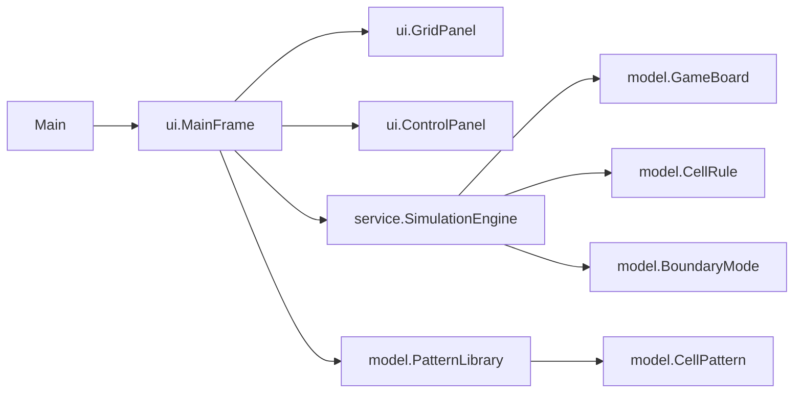
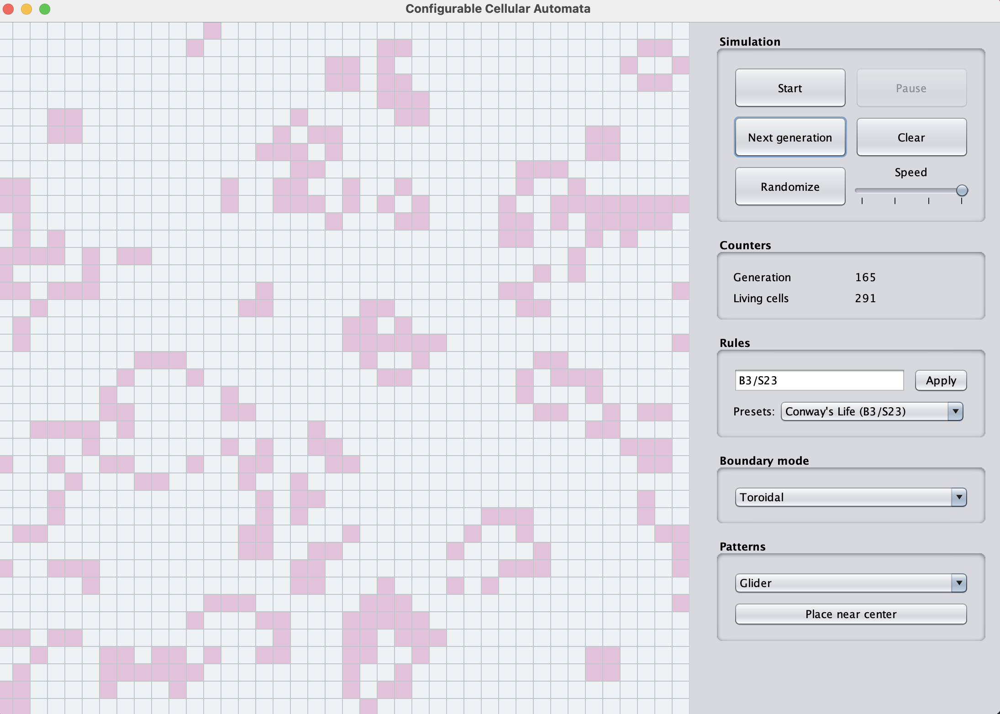
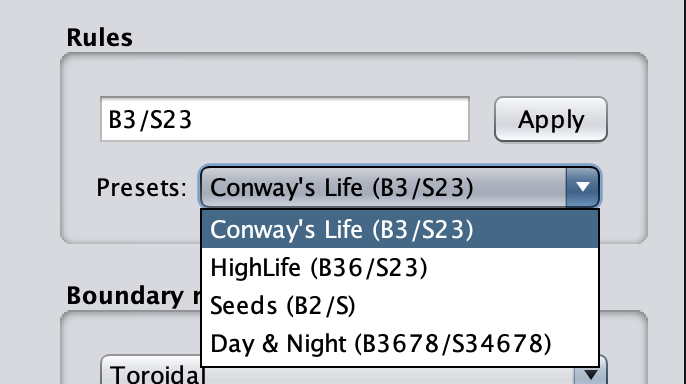

# Game of Life

A configurable cellular automata simulator built with Java Swing, supporting custom birth/survival rules, automatic simulation, pattern presets, and multiple boundary modes.

## Project Overview

This project is a desktop implementation of Conway-style cellular automata. It started as a single Swing class and has been refactored into a small portfolio project with separate model, simulation, and UI responsibilities.

The app provides a 40 by 40 interactive board, configurable rules, automatic playback, generation counters, built-in patterns, and boundary-mode selection.

## Cellular Automata

A cellular automaton is a mathematical model built on a discrete two-dimensional grid. Every cell has a binary state: alive or dead. At each generation, every cell calculates its next state from the local neighborhood around it.

For Conway's Game of Life, the standard rule is written as `B3/S23`:

- `B3`: a dead cell is born when it has exactly 3 living neighbors.
- `S23`: a living cell survives when it has exactly 2 or 3 living neighbors.

The board evolves in discrete generations. In toroidal mode, the top and bottom edges connect and the left and right edges connect. This wrap-around behavior is implemented with modular arithmetic.

## Features

- Interactive Java Swing grid.
- Start, pause, next-generation, clear, and randomize controls.
- Speed slider powered by `javax.swing.Timer`.
- Generation and living-cell counters.
- Rule input using `B.../S...` notation.
- Presets for Conway's Life, HighLife, Seeds, and Day & Night.
- Built-in Glider, Blinker, Beacon, and Lightweight spaceship patterns.
- Toroidal and fixed-dead boundary modes.
- Unit tests for rules, board behavior, neighbor counting, and evolution.

## Technologies

- Java 17
- Java Swing
- Maven
- JUnit 5
- GitHub Actions

## Architecture



- `model`: board state, rules, boundary modes, and built-in patterns.
- `service`: generation calculation and neighbor counting.
- `ui`: Swing rendering, controls, and application coordination.
- `Main`: Event Dispatch Thread startup.

## Controls

- Click a cell to toggle it alive or dead.
- Use `Start` and `Pause` to run or stop automatic simulation.
- Use `Next generation` to advance one step.
- Use `Clear` to reset the board.
- Use `Randomize` to seed the board with random live cells.
- Adjust the speed slider to change timer delay.
- Enter a rule such as `B3/S23` and click `Apply`.
- Select a boundary mode from the dropdown.
- Select a pattern and click `Place near center`.

## Boundary Modes

- `Toroidal`: positions outside the board wrap around using `Math.floorMod`.
- `Fixed dead`: positions outside the board are treated as dead cells.

## Included Presets

- Conway's Life: `B3/S23`
- HighLife: `B36/S23`
- Seeds: `B2/S`
- Day & Night: `B3678/S34678`

## Build And Run

```bash
mvn clean package
java -jar target/game-of-life-1.0.0-SNAPSHOT.jar
```

You can also run `Main` directly from an IDE after Maven imports the project.

## Test

```bash
mvn test
```

## Screenshots

### Main Simulation Board



### Rule And Boundary Controls



## Roadmap

- Add keyboard shortcuts for common controls.
- Add optional pattern placement by clicking the board.
- Add import/export for common pattern formats such as RLE.
- Add a packaged application distribution.

## Author

s23245
